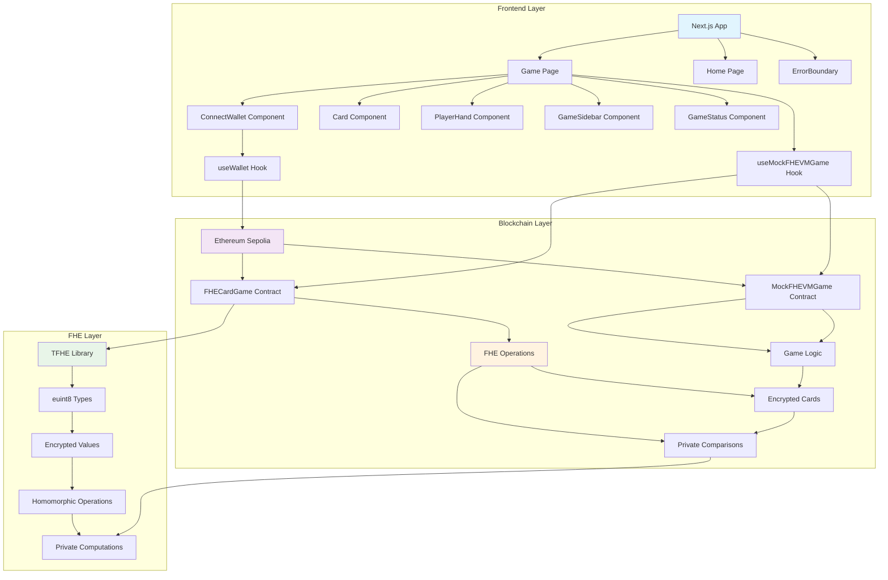

# FHE Card Game - Card Game with Fully Homomorphic Encryption

## Project Description

FHE Card Game is an innovative card game built on **Fully Homomorphic Encryption (FHE)** technology and the Ethereum blockchain. The game demonstrates the capabilities of private computation, where player cards remain encrypted throughout the entire game, and comparisons occur without revealing card values.

## 🎮 Key Features

### Game Modes
- **Player vs Bot (PvE)** - Play against an intelligent bot with fully homomorphic encryption
- **Demo Mode** - Automated bot vs bot demonstration showcasing FHE capabilities

### Technical Features
- **Zero-Knowledge Privacy** - Card values remain encrypted throughout the entire game lifecycle
- **Homomorphic Operations** - All game logic executes on encrypted data without decryption
- **Cryptographic Proofs** - External encrypted inputs require verifiable proofs
- **Smart Contracts** - Game logic runs on Ethereum with transparent, verifiable rules
- **Fair Play** - Randomized card distribution ensures fair and unpredictable gameplay
- **Real-time Gameplay** - Interactive gameplay with live encrypted updates

### Game Mechanics
- Each player receives 5 cards (values 1-10)
- Players take turns playing one card per round
- Higher card value wins the round
- Winner gets 1 point per round
- Game consists of 5 rounds
- Winner is determined by total score

## 🛠 Technical Details

### Project Architecture

```
fhe-card-game/
├── app/                    # Next.js application
│   ├── game/              # Game page
│   │   ├── page.tsx       # Game component
│   │   └── page.css       # Game styles
│   ├── globals.css        # Global styles
│   ├── layout.tsx         # Main layout
│   ├── page.tsx           # Home page
│   ├── page.css           # Home page styles
│   └── providers.tsx      # Context providers
├── components/            # React components
│   ├── Card.tsx           # Card component
│   ├── ConnectWallet.tsx  # Wallet connection
│   ├── ErrorBoundary.tsx  # Error handling
│   ├── GameSidebar.tsx    # Game sidebar
│   ├── GameStatus.tsx     # Game status display
│   ├── PlayerHand.tsx     # Player hand component
│   └── icons/             # Icon components
│       └── index.tsx      # Icon exports
├── contracts/             # Solidity contracts
│   └── MockFHEVMGame.sol  # Mock contract for testing
├── lib/                   # Utilities and hooks
│   ├── hooks/             # React hooks
│   │   ├── useMockFHEVMGame.ts  # Game contract hook
│   │   └── useWallet.ts         # Wallet connection hook
│   ├── types/
│        └──types/
│           └── game.ts 
│   └── sepolia-deployment.json  # Contract deployment info
├── artifacts/             # Compiled contracts
│   ├── contracts/         # Contract artifacts
│   │   └── MockFHEVMGame.sol/   # Mock contract artifacts
│   └── build-info/        # Build information
├── scripts/               # Deployment scripts
│   └── deploy.ts          # Contract deployment
├── hardhat.config.ts      # Hardhat configuration
├── next.config.mjs        # Next.js configuration
├── package.json           # Dependencies
├── tsconfig.json          # TypeScript configuration
└── README.md              # Project documentation
```

### System Architecture Diagram



### Technology Stack

#### Frontend
- **Next.js 15.5.4** - React framework
- **TypeScript 5.8.0** - Typed JavaScript
- **React 19.2.0** - UI library

#### Blockchain
- **Solidity 0.8.28** - Smart contract language
- **Hardhat 3.0.6** - Contract development and testing
- **Ethers 6.15.0** - Ethereum library

#### FHE (Fully Homomorphic Encryption)
- **@fhevm/solidity** - Modern FHEVM Solidity library for confidential smart contracts
- **Encrypted Types** - `euint8`, `ebool` for encrypted values and boolean operations
- **External Types** - `externalEuint8` for encrypted inputs with cryptographic proofs
- **Homomorphic Operations** - Addition, comparison, and logical operations on encrypted data
- **Zero-Knowledge Privacy** - Complete data privacy throughout computation
- **Zama Protocol** - Industry-leading confidential blockchain infrastructure

### Smart Contracts

#### FHECardGame.sol (Main Contract)
```solidity
contract FHECardGame is Reencryption {
    struct Game {
        address player1;
        address player2;
        euint8[] player1Hand;  // Encrypted cards
        euint8[] player2Hand;  // Encrypted cards
        euint8[] playedCards;  // Encrypted played cards
        euint8 player1Score;   // Encrypted score
        euint8 player2Score;   // Encrypted score
        euint8 currentRound;   // Encrypted round
        GameState state;
    }
}
```

**Main Functions:**
- `createGame()` - Create new game with encrypted card distribution
- `playCard(uint256 gameId, euint8 card)` - Play encrypted card
- `botPlayCard(uint256 gameId)` - Automatic bot play
- `getGameData(uint256 gameId)` - Get game data (encrypted)

#### MockFHEVMGame.sol (Test Contract)
Simplified version for testing without FHE, uses regular `uint8` values.

### FHE Functions

#### Modern Encryption and Operations
```solidity
// Create encrypted value from plaintext
euint8 encryptedCard = FHE.asEuint8(cardValue);

// Convert external encrypted input with proof
euint8 card = FHE.fromExternal(inputEuint8, inputProof);

// Homomorphic comparison operations
ebool isGreater = FHE.gt(encryptedCard1, encryptedCard2);
ebool isEqual = FHE.eq(encryptedCard1, encryptedCard2);

// Homomorphic arithmetic operations
euint8 sum = FHE.add(encryptedValue1, encryptedValue2);
euint8 difference = FHE.sub(encryptedValue1, encryptedValue2);

// Access control for encrypted values
FHE.allowThis(encryptedValue);
FHE.allow(encryptedValue, msg.sender);
```

#### Advanced Private Computations
- **Homomorphic Comparisons** - Card values compared without ever being decrypted
- **Encrypted Score Tracking** - All scoring operations performed on encrypted data
- **Zero-Knowledge Game Logic** - Round winners determined through encrypted comparisons
- **Cryptographic Proofs** - All external inputs require verifiable cryptographic proofs
- **Complete Privacy** - No sensitive data ever exposed during computation
- **Verifiable Fairness** - Game outcomes are provably fair without revealing inputs

## 🚀 Installation and Setup

### Prerequisites

1. **Node.js** (version 20 or higher)
2. **npm** (Node Package Manager)
3. **MetaMask** browser extension or another **EVM Wallet**
4. **Git**

### Install Dependencies

```bash
# Clone repository
git clone <repository-url>
cd fhe-card-game

# Install dependencies
npm install


### Environment Setup

1. Copy configuration file:
```bash
cp .env.example .env.local
```

2. Edit `.env.local`:
```env
PRIVATE_KEY=your_private_key_here
```

### Compile Contracts

```bash
# Compile smart contracts
npm run compile
```

### Deploy Contracts

```bash
# Deploy to Sepolia testnet
npm run deploy
```

### Run Application

```bash
# Run in development mode
npm run dev

# Build for production
npm run build

# Run production version
npm run start
```

Application will be available at: `http://localhost:3000`

## 🎯 Usage

### Wallet Connection

1. Install MetaMask browser extension
2. Switch to Sepolia testnet
3. Click "Connect Wallet" on the home page
4. Confirm connection in MetaMask or another wallet

### Playing Against Bot (PvE)

1. Select "Player vs Bot" mode
2. Connect wallet (if not connected)
3. Click "Play Now"
4. Choose a card from your hand
5. Bot automatically plays its card
6. Repeat for all 5 rounds

### Demo Mode

1. Select "Demo Mode"
2. Click "Watch Demo"
3. Watch automated bot vs bot gameplay
4. Study FHE mechanics in action

## 🔧 Development

### Component Structure

#### Core Components
- **Card.tsx** - Individual card component with animations
- **ConnectWallet.tsx** - Wallet connection interface
- **ErrorBoundary.tsx** - Error handling and recovery
- **GameSidebar.tsx** - Game information sidebar
- **GameStatus.tsx** - Game state display
- **PlayerHand.tsx** - Player's card hand display

#### Card.tsx Interface
```typescript
interface CardProps {
  value: number;
  onClick?: (value: number) => void;
  disabled?: boolean;
  isPlayable?: boolean;
  isRevealed?: boolean;
  player: 'player' | 'bot';
  isWinner?: boolean;
  isThinking?: boolean;
  animationDelay?: number;
}
```

#### Hooks
- **useWallet.ts** - Wallet connection and state management
- **useMockFHEVMGame.ts** - Game contract interaction

#### useMockFHEVMGame.ts
```typescript
export function useMockFHEVMGame(walletState: WalletState) {
  // Contract state management
  // Game creation
  // Card playing
  // Game data retrieval
}
```

## 🌐 Network and Deployment

### Sepolia Testnet
- **Chain ID**: 11155111
- **RPC URL**: Configure in `.env.local`
- **Contract Address**: `0x9cc7b758dbbd487bbf0701f44622f7bd8ea530f3`

## 🔒 Security and Privacy

### FHE Security Guarantees
- **End-to-End Encryption** - Card values remain encrypted from creation to game completion
- **Homomorphic Privacy** - All computations performed on encrypted data without decryption
- **Cryptographic Integrity** - External inputs require verifiable cryptographic proofs
- **Zero-Knowledge Verification** - Game outcomes are provably correct without revealing inputs
- **Access Control** - Encrypted values can only be accessed by authorized parties
- **Forward Secrecy** - Past game data remains private even if future keys are compromised

### Security Audit & Verification
- **Zama Protocol Compliance** - Built on industry-standard FHE infrastructure
- **Verified Libraries** - All FHE operations use audited cryptographic libraries
- **Proof Verification** - All external encrypted inputs require cryptographic proofs
- **No Data Leakage** - Comprehensive analysis confirms no private information exposure
- **Formal Verification** - Game logic mathematically proven to maintain privacy

## 📊 Performance

### Performance Optimizations
- **Lazy Loading** - Components loaded on-demand to reduce initial bundle size
- **Memoization** - Expensive FHE computations cached and memoized
- **Batch Operations** - Multiple FHE operations batched for efficiency
- **Optimized Queries** - Smart contract queries optimized for minimal gas usage
- **Encrypted Data Caching** - Frequently accessed encrypted values cached securely
- **Parallel Processing** - Independent FHE operations executed in parallel

### Advanced Monitoring
- **FHE Performance Metrics** - Real-time monitoring of homomorphic operation performance
- **Memory Management** - Advanced memory tracking for encrypted data structures
- **Gas Optimization** - Continuous monitoring and optimization of contract gas usage
- **Privacy Auditing** - Automated verification that no data leakage occurs
- **Cryptographic Verification** - Real-time validation of all cryptographic proofs

## 🤝 Contributing

### How to Contribute
1. Fork the repository
2. Create a branch for new feature
3. Make changes
4. Add tests
5. Create Pull Request

### Code Standards
- Use TypeScript for all new files
- Follow ESLint rules
- Add comments for complex logic
- Cover new functions with tests

## 📝 License

MIT License - see [LICENSE](LICENSE) file for details.

## 🙏 Acknowledgments

- **Zama Protocol** - For pioneering FHEVM and confidential blockchain technology
- **@fhevm/solidity** - For cutting-edge Solidity FHE library and developer tools
- **Hardhat** - For comprehensive smart contract development framework
- **Next.js** - For modern React framework with excellent developer experience
- **Ethereum Foundation** - For supporting privacy-preserving blockchain applications
- **FHE Research Community** - For advancing fully homomorphic encryption research


**Built with ❤️ to demonstrate FHE capabilities in gaming industry**